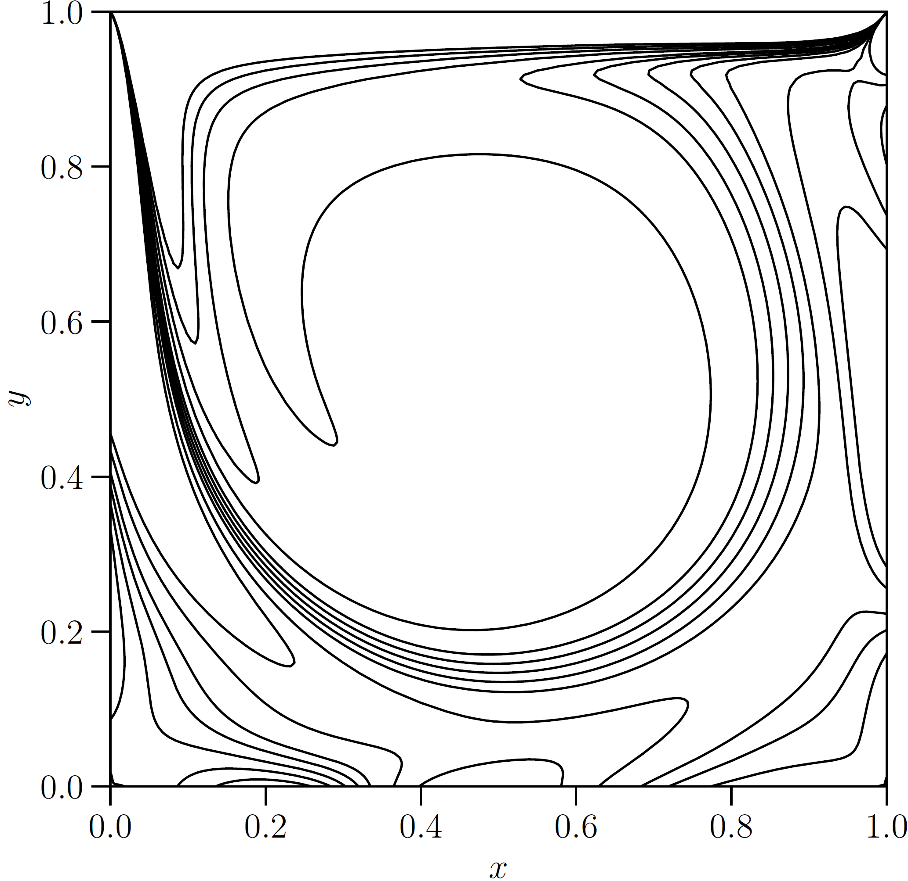

.. _Gallery-NS2-LDC:

=================
Lid-driven cavity
=================

The lid-driven cavity flow is a incompressible viscous flow.

In 2-dimensions, it is usually cast as follows. The domain is set to be
:math:`\Omega=[0,1]^2` with four infinite no-slip solid walls. The media
is still initially. From time :math:`t=0`,
the top wall, i.e. :math:`y=1`, moves left with a constant speed, i.e. the lid speed,
:math:`\left.\boldsymbol{u}\right|_{\mathrm{lid}}=\begin{bmatrix}-1, 0\end{bmatrix}^\mathsf{T}`,
and drives the viscous flow. The simulation stops when the flow becomes steady.

.. _NS2-NS2-LDC-omega:

    The steady case of :math:`\omega` for the 2-dimensional lid-driven cavity flow.

For a *phyem* implementation of the normal dipole collision test case in Section 5.4 of
`[MEEVC, Zhang et al., JCP (2024)] <https://linkinghub.elsevier.com/retrieve/pii/S0021999124003292>`_, click
:download:`phyem_ldc.py <../../../../../tests/msepy/MEEVC2/lid_driven_cavity_2d.py>`.

|

↩️  Back to :ref:`GALLERY-NS`.
