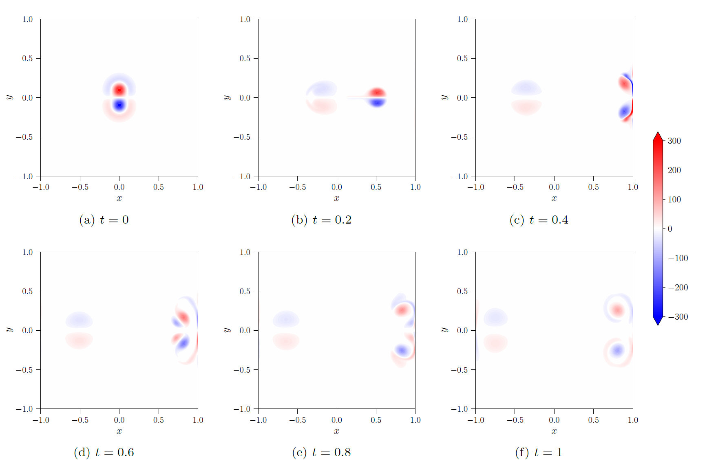

.. _Gallery-NS2-NDC:

=======================
Normal dipole collision
=======================

The normal dipole collision flow is a 2-dimensional incompressible NS flow.

    The vorticity field of the normal dipole collision flow at
    :math:`t\in\left\lbrace0,0.2,0.4,0.6,0.8,1\right\rbrace` with contour.

For a *phyem* implementation of the normal dipole collision test case in Section 5.3 of
`[MEEVC, Zhang et al., arXiv] <https://arxiv.org/abs/2307.08166>`_, click
:download:`phyem_ndc.py <../../../../../tests/msepy/MEEVC2/normal_dipole_collision.py>`

|

↩️  Back to :ref:`GALLERY-NS`.
