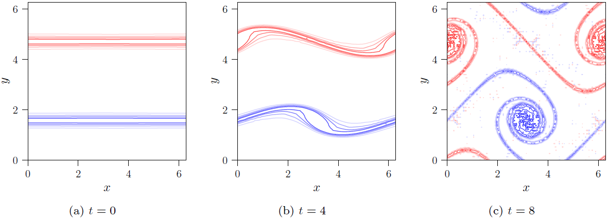

==================
Shear layer rollup
==================

.. automodule:: tests.samples.iniCond_shear_layer_rollup
    :undoc-members:

..
    .. image:: t0.png
        :width: 33 %
    .. image:: t4.png
        :width: 33 %
    .. image:: t8.png
        :width: 33 %

    The vorticity field of the shear layer rollup flow at :math:`t\in\left\lbrace0,4,8\right\rbrace` with contour
    lines for :math:`\left\lbrace\pm 1,\pm 2, \cdots, \pm 6\right\rbrace`.

For a *phyem* implementation of the shear layer rollup using the dual-field method introduced in
`[Dual-field NS, Zhang et al.] <https://doi.org/10.1016/j.jcp.2021.110868>`_, click
:download:`phyem_slr.py <../../../../../tests/msepy/dualNS2/shear_layer_rollup.py>`

|

↩️  Back to :ref:`GALLERY-NS`.