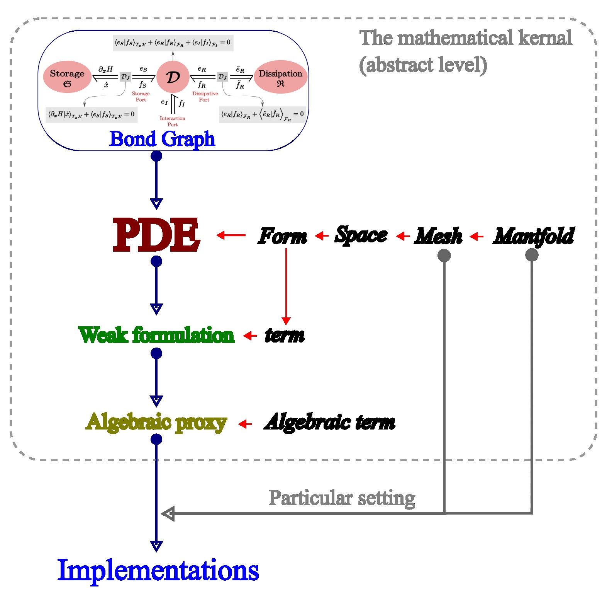

About
=====

Nowadays, if we want to simulate something, we usually have two options:

- We can use commercial software which works like a black-box; we only need to understand the generic ideas like pre-processing and post-processing.
- We can use open-access libraries to set up the simulation. In this way, we need to work out the math (the abstract stage) on paper, and then to employ functionalities of the libraries accordingly.

We aim to provide a third option which is featured as explained below.

Features
--------
The most obvious features of *phyem* are

.. admonition:: Features

    1) Port based multi-physics representation; enable setting up **LEGO**-like simulation.

    2) Equation, weak formulation, and discretization (the abstract stage) handling at a program level.

    3) Differential forms based mathematical representation.

This means we can work with *phyem* from the problem setting up stage.

Skeleton
--------

The skeleton of a *phyem* simulation is illustrated in the figure below.

Currently, to startup a simulation, we ideally need to input a ``PDE``, which is made of ingredients ``forms``.
``forms`` are elements of ``spaces`` which are built upon a ``mesh``. And the ``mesh`` is an object over the domain,
a ``manifold``.

Once we have a ``PDE`` instance, we can follow the standard finite element process and obtain the ``weak formulation``
of the ``PDE``. Then particular temporal and spacial discretization schemes can be applied to the ``weak formulation``.
The fully discrete ``weak formulation`` eventually can be reformatted into an algebraic formation, i.e., the
``algebraic proxy`` which is ready to be sent to a particular ``implementation``.

With in the ``implementation``, we can config the domain, i.e., the ``manifold``, to be an exact one, and config the
``mesh`` to be a real mesh. This enables us to interpolate the ``algebraic proxy`` as real algebraic systems which then
can be solved.

|

↩️  Back to :ref:`PHYEM`.
